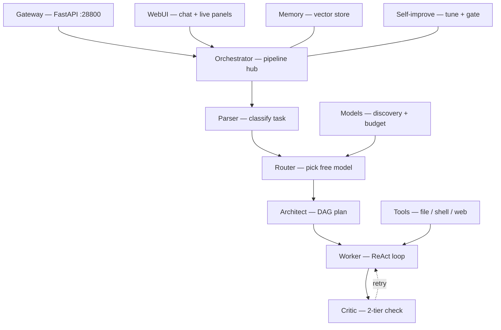

# FreePalp — architecture

A multi-agent orchestrator that runs real work on **free and local LLMs**. A request
enters through the gateway, the orchestrator drives a five-stage agent pipeline, and
supporting subsystems handle model routing, tools, memory and self-improvement.

> This map is generated from the actual code (modules, line counts, internal imports),
> not from memory. Regenerate after large refactors.

## Data flow

The pipeline: the parser classifies the task, the router picks the best available free
model (quota/cooldown aware), the architect decomposes complex tasks into a DAG, the
worker executes via a ReAct tool loop, and the two-tier critic checks the result
(deterministic checks first, an LLM score only when needed). A failed result loops back
to the worker for a retry.

## Module reference

### Entry
| Module | Lines | Role |
|---|---|---|
| `gateway.py` | 1847 | FastAPI app, HTTP/SSE endpoints, WebUI serving (port 28800) |
| `app.py` | 769 | launcher, first-run setup, CLI entry |

### Agent pipeline (`agents/`)
| Module | Lines | Role |
|---|---|---|
| `worker_agent.py` | 923 | ReAct loop — calls tools itself, writes files, iterates |
| `critic_agent.py` | 389 | tier-1 deterministic checks + tier-2 LLM score (0–1) |
| `architect_agent.py` | 192 | decomposes complex tasks into a dependency graph |
| `tool_agent.py` | 135 | tool registry + dispatch for the worker |

### Orchestration & routing (`core/`)
| Module | Lines | Role |
|---|---|---|
| `orchestrator.py` | 1101 | pipeline hub — wires parser → router → architect → worker → critic |
| `model_discovery.py` | 803 | live discovery across 14+ providers, catalog, status |
| `token_budget.py` | 399 | per-provider quota tracking + 429 cooldowns |
| `router.py` | 393 | picks best available model by task type and tier |
| `task_parser.py` | 112 | classifies the incoming task |
| `prompt_loader.py` | 107 | loads the active prompt version |
| `skill_library.py` | 218 | distils successful retries into reusable `SKILL.md` |

### Tools (`tools/`)
| Module | Lines | Role |
|---|---|---|
| `system_tools.py` | 491 | system / process helpers |
| `github_tools.py` | 437 | GitHub operations |
| `notification_tools.py` | 405 | desktop / channel notifications |
| `file_tools.py` | 378 | sandboxed file read/write (path-traversal guarded) |
| `sanitizer.py` | 282 | neutralize untrusted content (injection defence) |
| `browser_tools.py` | 274 | browser automation |
| `web_tools.py` | 197 | web search / fetch |
| `shell_tools.py` | 159 | whitelisted shell commands |
| `tools_filter.py` | 102 | per-task tool selection |

### Memory (`memory/`)
| Module | Lines | Role |
|---|---|---|
| `memory_manager.py` | 716 | session + long-term memory orchestration |
| `consolidation.py` | 471 | periodic consolidation / digests |
| `vector_store.py` | 247 | embeddings store for recall |
| `session_memory.py` | 207 | per-session memory |

### Self-improvement (`core/self_improvement/`)
`controller.py` runs the cycle: `metrics.py` (Evaluator) analyses recorded task metrics →
`improver.py` generates a prompt change via LLM → `version_manager.py` proposes a new
version → gate (test + held-out validation in `validator.py`) → activate or roll back.

### MCP (`core/`)
`mcp_client.py`, `mcp_builder.py`, `mcp_discovery.py` — connect external MCP servers and
register their tools into the worker's toolset.

## Where the heavy code lives
`gateway.py` (1847), `orchestrator.py` (1101), `worker_agent.py` (923),
`model_discovery.py` (803), `memory_manager.py` (716) — start here when orienting.
