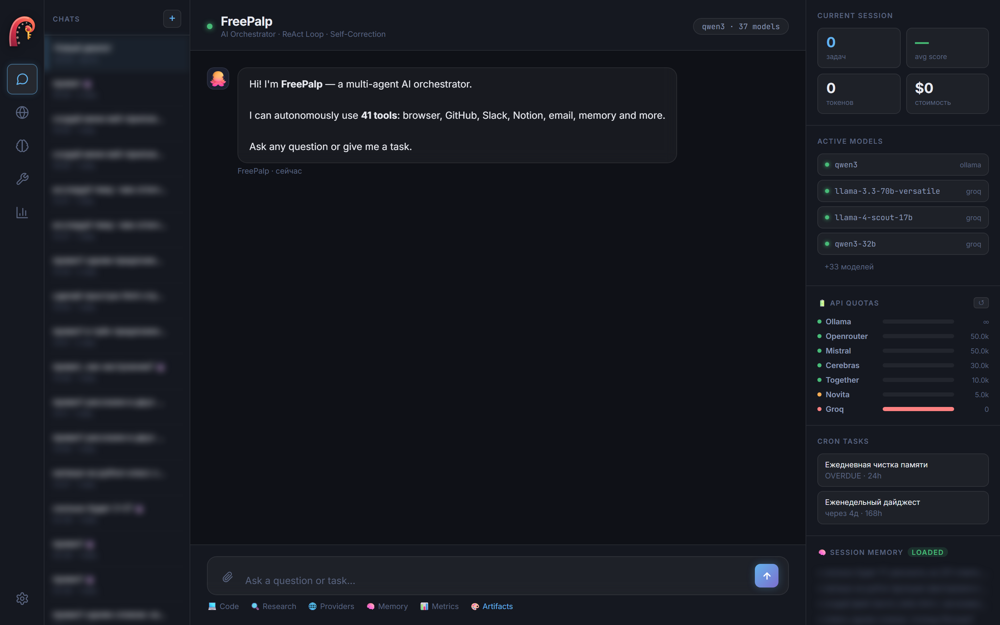
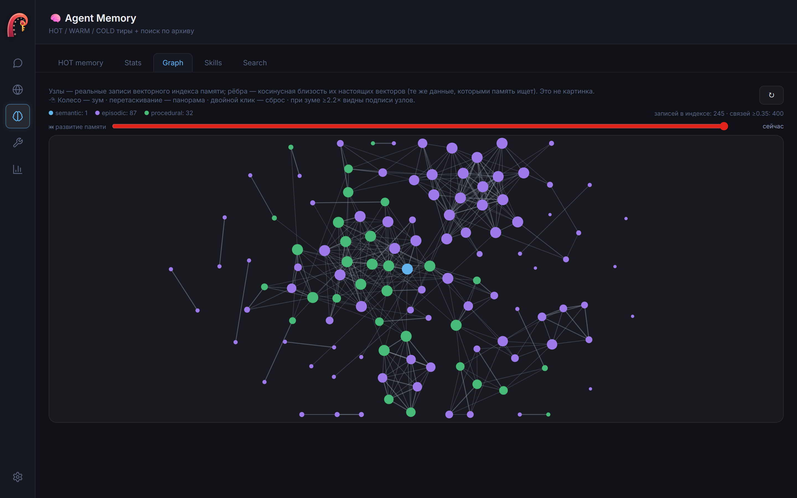
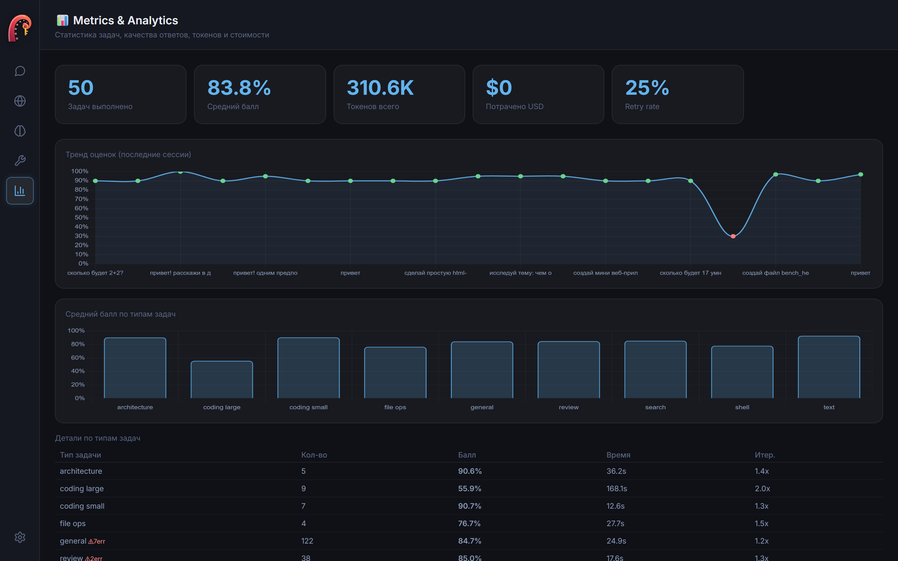

<p align="center">
  
</p>

<p align="center">
  <b>运行在免费模型上的多智能体 AI 编排器。</b><br>
  自我改进 · 持久记忆 · MCP · 令牌流式输出 · WebUI
</p>

<p align="center">
  <a href="README.md">English</a> ·
  <a href="README.ru.md">Русский</a> ·
  <b>中文</b>
</p>

<p align="center">
  <br>
  <em>聊天界面：实时 token/配额仪表、活跃模型、会话记忆 —— 运行在免费提供商 + 本地 Ollama 上</em>
</p>

<p align="center">
  
  <br>
  <em>真实的向量记忆图（语义 / 情景 / 程序）· 按任务的指标与分析</em>
</p>

<p align="center">
  📝 <b>设计背后的故事：</b> <a href="https://dev.to/verdyshd/free-students-paid-teachers-how-cheap-llms-learn-from-expensive-ones-520m">Free students, paid teachers — how cheap LLMs learn from expensive ones</a>
</p>

---

## 这是什么

FreePalp 是一个多智能体编排器，使用**免费和本地大语言模型**完成真实工作。
路由器在 10+ 个提供商（Groq、OpenRouter、Cerebras、Gemini、Mistral、Together、
[models.dev](https://models.dev) 目录以及本地 **Ollama**）中为每个任务挑选最佳
可用模型；工作智能体通过 ReAct 工具循环执行；双层评审先做廉价的确定性检查，
仅在必要时才调用 LLM 评审。

**核心差异：纠错会累积。** 当廉价模型失败、更强的模型成功时，可用的工作流程
会被提炼为可复用的 `SKILL.md`（兼容 Claude Code），并在下次遇到同类任务时注入
提示词——于是廉价模型第一次就能做对。免费学生、付费老师、不断成长的技能。

## 快速开始

```bash
git clone https://github.com/verdyshd/freepalp
cd freepalp
pip install -e .          # 安装 `freepalp` 命令
freepalp                  # 在 http://localhost:28800 启动 WebUI
```

**没有任何密钥**也能通过本地 Ollama 运行。要添加免费云模型，把密钥写入 `.env`
（免费的 Groq 密钥每天给 50 万 token）：

```bash
cp .env.example .env
# 在 .env 中填入 GROQ_API_KEY=gsk_... — 在 https://console.groq.com/keys 获取
```

## 功能

- **10+ 提供商、50+ 模型**，按任务类型自动路由，实时感知配额/冷却。
- **本地优先**（Ollama）——无限回退，可完全离线；用过则启动时自动拉起。
- **DAG 分解 + 并行子智能体**——复杂的多文件任务由架构师拆成依赖图，独立步骤
  并行执行，每个都是看得到前序产物的专注工作者。
- **老师→技能 提炼**——成功的重试变成可复用的 `SKILL.md`，让廉价模型越来越强。
- **MCP 客户端**——在 `config/mcp_servers.json` 接入任意 [MCP](https://modelcontextprotocol.io)
  服务器，其工具自动出现在智能体面前（文件系统、GitHub、数据库等数百个现成服务器）。
- **OpenAI 兼容 API**——把任意 IDE 插件或 OpenAI 客户端指向
  `http://localhost:28800/v1`，整个编排器即在你的编辑器之下运行。
- **令牌流式输出**——最终答案在 WebUI 中逐字打出。
- **深度研究**——一个工具完成多角度网络搜索、抓取顶部页面，智能体撰写**引用真实
  来源**的报告（确定性触发器强制真实搜索，杜绝编造链接）。
- **产物预览**——智能体生成的 HTML（游戏、页面）在聊天内的沙箱 iframe 中直接运行。
- **持久记忆**——HOT/WARM/COLD 分层 + 可在界面里浏览的真实向量图，外加对整个
  会话历史的 **FTS5 搜索**。
- **自我改进**——提出提示词新版本，由留出指标把关，回归时自动回滚。
- **可靠性优先于盲信 LLM**——确定性检测器在结果到你之前抓出虚构的文件写入、身份
  错乱、盲目重写、泄漏的工具调用与占位内容。
- **WebUI**——聊天、实时 token/配额仪表、记忆图、指标、设置。
- **停止按钮**——任务中途打断智能体（界面与 CLI 的 Ctrl+C）。

## 安全

FreePalp 使用工具、shell 并会自我修改源码，因此认真对待安全：沙箱化文件访问、
阻止元字符注入的 shell 白名单、确定性测试套件（`test_security.py`，29 个用例）。
详见 [THREAT_MODEL.md](THREAT_MODEL.md)（含残留风险的诚实说明）。

## 支持项目

FreePalp 免费且采用 MIT 许可。如果它对你有用，支持能让它继续前行：

- 💖 **GitHub Sponsors：** https://github.com/sponsors/verdyshd
- 🪙 **USDT (TRC-20)：** `TFAfqkvNDpJPeKWqm4QiFiU5fa7RC97GZx`

## 许可

MIT —— 见 [LICENSE](LICENSE)。
